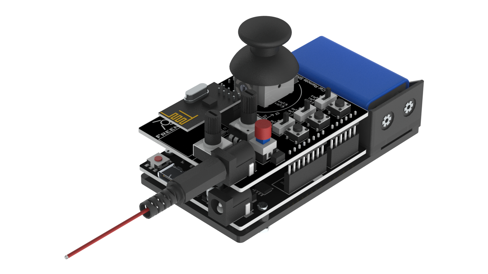
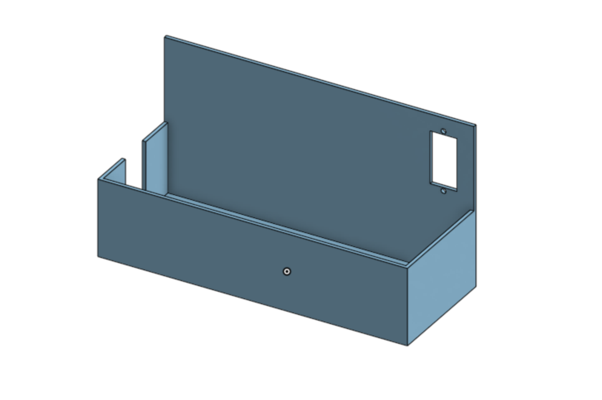
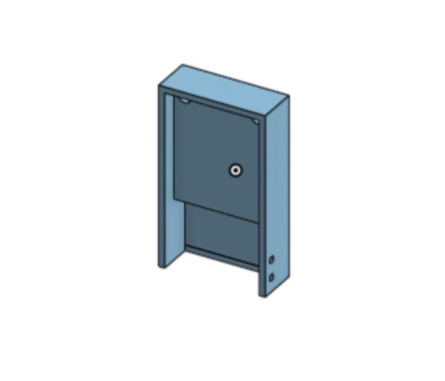
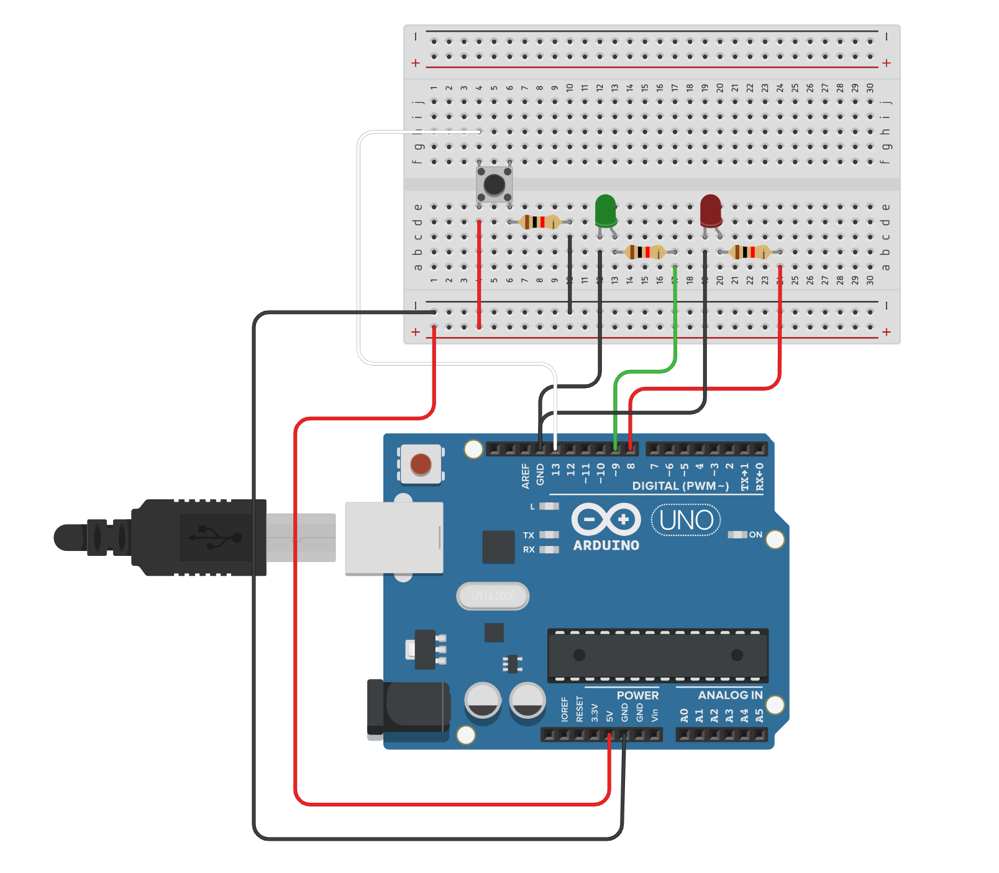

# Hexapod
My project is a six-legged robot that can crawl, turn, move its body in place, and perform various other complex actions. It is controlled wirelessly by a remote controller which toggles its various modes. Aside from being built from acryllic parts, the hexapod also has custom 3D printed parts that allow it to safely carry its battery, and is also equipped with a camera capable of taking photos at various angles. 
<!---Replace this text with a brief description (2-3 sentences) of your project. This description should draw the reader in and make them interested in what you've built. You can include what the biggest challenges, takeaways, and triumphs from completing the project were. As you complete your portfolio, remember your audience is less familiar than you are with all that your project entails!-->

| **Engineer** | **School** | **Area of Interest** | **Grade** |
|:--:|:--:|:--:|:--:|
| Arunabh T | Monta Vista High School | Aerospace Engineering | Incoming Senior |

<!---**Replace the BlueStamp logo below with an image of yourself and your completed project. Follow the guide [here](https://tomcam.github.io/least-github-pages/adding-images-github-pages-site.html) if you need help.**

-->
  
# Third Milestone - 6/21/2024

<iframe width="560" height="315" src="https://www.youtube.com/embed/gnmgMjtF2iM" title="YouTube video player" frameborder="0" allow="accelerometer; autoplay; clipboard-write; encrypted-media; gyroscope; picture-in-picture; web-share" allowfullscreen></iframe>

My third milestone involved creating the controller for the hexapod and getting it to work with the hexapod robot. The controller consists of a board that resembles an Arduino UNO, a shield that goes on top of it with several buttons, potentiometers, switches, and a single joystick. All of these serve a function in moving the robot in some way. Depending on which buttons or switches are activated, the hexapod has different functions. For instance, if only the first switch is on, the hexapod uses the joystick's values to crawl in different directions without rotating. However, when both the first and second swithces are turned on, the robot will crawl, with the addition of turning when sideways inputs are read. The hexapod also makes use of the potentiometers to adjust its height, and this function is on regardless of which switches have been turned on. The controller is powered by a 9V battery which is attached to the rest of a controller through an acryllic plate. It is wireless, and so it communicates with the robot through a wireless module that is on pins on top of the shield. The robot has an identical module that receives these signals and moves the robot.

I have also completed my first modification to my robot, which was adding a battery mount to the hexapod. I decided to make this because with the current situation, there was no safe space for the battery to sit on without falling off. I CADed this in Onshape, and decided to use two of the holes on the top as the places for the mount ot be inserted. While working on this, I learned that my current design for it would not work well since the legs at the bottom of my design would cause the whole 3D print to turn out badly. In order to prevent this, I made the legs a separate file and included holes in the box that the battery would sit in for the legs to insert into. After having these things 3D printed, I tested them, and luckily they fit together quite well, with the exception of the corners of the legs needing to be filed down. I still plan on changing this for the future because the legs are not long enough to allow me to put any wires onto the extra pins that the robot controller provides, and I also may change this to accomodate additional modifications. Now that my base project is completely finished, I will start modifying the robot, and the first one in mind for me is adding a camera to the hexapod.

# Second Milestone - 6/18/2024

<iframe width="560" height="315" src="https://www.youtube.com/embed/BjwcGSSZ8Yg" title="YouTube video player" frameborder="0" allow="accelerometer; autoplay; clipboard-write; encrypted-media; gyroscope; picture-in-picture; web-share" allowfullscreen></iframe>

For my second milestone, I finished assembling the rest of the legs of the hexapod. I was able to accomplish this rather quickly because I had assembled the parts of all six legs while working towards getting to my first milestone. This made it so that I only needed to screw together the componenets of each leg for them to be mechanically finished. However, the wires of the 18 servos on the robot were quite messy and would touch the floor, and so I used the provided cable tidy to keep the wires together and take up less space. 

After this, I calibrated the servos. This was a process where I moved each legtip to a specific spot marked on a callibration paper, and the positions of the servos were saved onto the robot controller. This ensured that every time the robot started up, it would be able to start at a fixed position. With the hexapod callibrated, I moved on to testing it with the functions in the Processing app. The robot was able to walk, turn, move up and down, and perform several other functions. 

Now that I'm done with my second milestone, I will work on getting to my third. This involves getting the robot to perform all of these functions with the controller, and I also want to add a mount to the top of the robot for the battery to sit on.

# First Milestone - 6/17/2024

<iframe width="560" height="315" src="https://www.youtube.com/embed/CvkdEz7TmwI" title="YouTube video player" frameborder="0" allow="accelerometer; autoplay; clipboard-write; encrypted-media; gyroscope; picture-in-picture; web-share" allowfullscreen></iframe>

Here is my first milestone for my main project. I chose the hexapod since it looked fairly complex as well as customizable, and it had components of mechanical, electrical, and software engineering in it. The robot is made of several acryllic parts, a robot controller that runs on Arduino code, as well as 18 servos that move the six legs of the robot. While the final project will run with a remote control, it can also move while connected to my computer with the inputs fed through the Processing application. So far, I have built the entire base of the hexapod and also created all components of the six legs. I have gotten one of these legs fully assembled onto my robot, and it fully functions with the commands on Processing.

The biggest challenge so far has been getting the leg to work with the basic code. Although I did manage to get the servos running first try, the default position seemed to face completely upwards. I tried various solutions to fix this, but nothing seemed to work. After doing a little bit of research, I found out that the servos needed to be powered while I assembled the leg, so that it could default to a position closer to what I wanted. 

My plan now is to continue assembling the legs of the robot. Once they are assembled, I will callibrate the hexapod and test them with the provided code through Processing. At that point, I hope that it is able to walk and turn with no issues whatsoever.

# Bill of Materials

| **Part** | **Note** | **Price** | **Link** |
|:--:|:--:|:--:|:--:|
| Hexapod | This is the main kit for the base project, containing both the robot and its controller | $126.95 | <a href="https://www.amazon.com/Freenove-Raspberry-Crawling-Detailed-Tutorial/dp/B07FLVZ2DN/"> Link </a> |
| Camera | Used to take photos from the view of the hexapod robot | $25.99 | <a href="https://www.amazon.com/Arducam-Module-Megapixels-Arduino-Mega2560/dp/B012UXNDOY"> Link </a> |
| Arduino Mega 2560 | The computer that controlls the camer and LEDs | $48.90 | <a href="https://www.amazon.com/ARDUINO-MEGA-2560-REV3-A000067/dp/B0046AMGW0/"> Link </a> |
| LED Strip | Purely for aesthetic purposes, it goes through the colors of the rainbow | $22.99 | <a href="https://www.amazon.com/LOAMLIN-WS2812B-Individually-Addressable-Waterproof/dp/B0956JQ68N/"> Link </a> |
| PWM Wires | These wires are used to connect the arduino to the LEDs and camera, and the robot controller to the additional servo | $6.98 | <a href="https://www.amazon.com/Elegoo-EL-CP-004-Multicolored-Breadboard-arduino/dp/B01EV70C78/"> Link </a> |

# Code
## Hexapod Code
### one of the files

## Arduino LED Code
```c++
  #include <FastLED.h>
  #define NUM_LEDS 7
  #define DATA_PIN1 10
  #define DATA_PIN2 11
  
  int r[NUM_LEDS];
  int g[NUM_LEDS];
  int b[NUM_LEDS];
  int state[NUM_LEDS];
  CRGB leds[NUM_LEDS];
  CRGB leds2[NUM_LEDS];

void setup() {
 // put your setup code here, to run once:
 FastLED.addLeds<NEOPIXEL, DATA_PIN1>(leds, NUM_LEDS);
 FastLED.addLeds<NEOPIXEL, DATA_PIN2>(leds, NUM_LEDS);
 
 pinMode(9, OUTPUT);

 for(int i = 0; i < NUM_LEDS; i++){ //initialize LED color values
    r[i] = 255 - 15*i;
     g[i] = 15*i;
     b[i] = 0;
     state[i] = 0;
    //state values:
    //0 = red to green
    //1 = green to blue
    //2 = blue to red
 }
}
  
void loop() {
 for(int i = 0; i < NUM_LEDS; i++){
   if(r[i] == 255){
     state[i] = 0;
   }
   else if(g[i] == 255){
      state[i] = 1;
    }
   else if(b[i] == 255){
      state[i] = 2;
    }

   switch(state[i]){ //changes LED color based on state
      case 0:
          r[i]--;
          g[i]++;
          break;
      case 1:
          g[i]--;
          b[i]++;
          break;
      case 2:
          b[i]--;
          r[i]++;
          break;
   }
      leds[i].setRGB(r[i], g[i], b[i]);
      leds2[i].setRGB(r[i], g[i], b[i]);
 }
 FastLED.show();
 digitalWrite(9, HIGH);
 delay(10);
}
```

# Schematics 


<span style="font-size:0.8em;">Figure 1. 3D render of the base hexapod robot's mechanical parts without any modifications.</span>



<span style="font-size:0.8em;">Figure 2. 3D render of the robot's controller. This is the wireless controller that controls the robot's movement.</span>



<span style="font-size:0.8em;">Figure 3. 3D render of the mount that the battery and the camera motor go on.</span>



<span style="font-size:0.8em;">Figure 4. 3D render of the mount that the camera sits on.</span>

# Starter Project: Arduino - 6/12/2024

<iframe width="560" height="315" src="https://www.youtube.com/embed/97nzk2poyUE" title="YouTube video player" frameborder="0" allow="accelerometer; autoplay; clipboard-write; encrypted-media; gyroscope; picture-in-picture; web-share" allowfullscreen></iframe>

Here is my starter project. It is an arduino board with a proto shield on top of it as well as a breadboard on the side. This proto shield allows me to wire several components on top of the arduino. I also used a breadboard to wire a button to the arduino. I have wired two LEDs onto the proto shield, and they are both controlled by the button. I coded them such that the red LED only turns on while the button is pressed, and the green LED is turned on and off whenever the button gets pressed.

One of the biggest challenges I faced was with getting the button to work. I originally wanted to have the button soldered onto the proto shield, but after testing code with this setup, I found out that it was not a stable input source. After doing a little bit of research into wiring buttons, I learned that I needed a constant power source and resistor at the ground source, and so I made the decision to switch to wiring the button on my breadboard instead.

My starter taught me several basics of arduino code, such as how to initalize inputs and outputs, and I also learned how to use a breadboard. It also helped me refine my soldering skills, and I have become much more precise with soldering smaller wires together.

## Starter Bill of Materials

| **Part** | **Note** | **Price** | **Link** |
|:--:|:--:|:--:|:--:|
| Arduino UNO | Deploys the code and provides power to all components | $15.19 | <a href="https://www.elegoo.com/products/elegoo-uno-r3-board"> Link </a> |
| Breadboard | Allows for free wiring of buttons, sensors, and other components | $6.75 | <a href="https://www.amazon.com/BB400-Solderless-Plug-BreadBoard-tie-points/dp/B0040Z1ERO"> Link </a> |
| Proto Shield for Arduino | Allows for soldering of several components, and also provides custom space for buttons, LEDs, and capacitors that come with the shield. It also has extensions of several arduino ports.| $9.95 | <a href="https://www.adafruit.com/product/2077"> Link </a> 

## Starter Code
```c++
int buttonPin = 13;
int redLedPin = 8;
int greenLedPin = 9;
int buttonState = 0;
int buttonStore = 0;
int pressed = 0;

void setup() {
  pinMode(redLedPin, OUTPUT);
  pinMode(greenLedPin, OUTPUT);
  pinMode(buttonPin, INPUT);
}

void loop() {
  buttonState = digitalRead(buttonPin);
  if(buttonState == HIGH){
    digitalWrite(redLedPin, HIGH);
    if(pressed == 0){
      pressed = 1;
      if(buttonStore == 0){
        buttonStore = 1;
      }
      else{
        buttonStore = 0;
      }
    }
  }
  else{
    digitalWrite(redLedPin, LOW);
    if(pressed == 1){
      pressed = 0;
      if(buttonStore == 0){
        digitalWrite(greenLedPin, LOW);
      }
      else{
        digitalWrite(greenLedPin, HIGH);
      }
    }
  }
}
```

## Starter Schematics



<span style="font-size:0.8em;">Figure 1. Wiring diagram of the aruduino's LEDs and buttons. Although the LEDs are actually mounted on top of the proto shield, they are on the breadboard instead to show the wired connections in the circuitry.</span>

<!---# Schematics 
Here's where you'll put images of your schematics. [Tinkercad](https://www.tinkercad.com/blog/official-guide-to-tinkercad-circuits) and [Fritzing](https://fritzing.org/learning/) are both great resoruces to create professional schematic diagrams, though BSE recommends Tinkercad becuase it can be done easily and for free in the browser. 

# Code
Here's where you'll put your code. The syntax below places it into a block of code. Follow the guide [here]([url](https://www.markdownguide.org/extended-syntax/)) to learn how to customize it to your project needs. 

```c++
void setup() {
  // put your setup code here, to run once:
  Serial.begin(9600);
  Serial.println("Hello World!");
}

void loop() {
  // put your main code here, to run repeatedly:

}
```

# Other Resources/Examples
One of the best parts about Github is that you can view how other people set up their own work. Here are some past BSE portfolios that are awesome examples. You can view how they set up their portfolio, and you can view their index.md files to understand how they implemented different portfolio components.
- [Example 1](https://trashytuber.github.io/YimingJiaBlueStamp/)
- [Example 2](https://sviatil0.github.io/Sviatoslav_BSE/)
- [Example 3](https://arneshkumar.github.io/arneshbluestamp/)

To watch the BSE tutorial on how to create a portfolio, click here.-->
